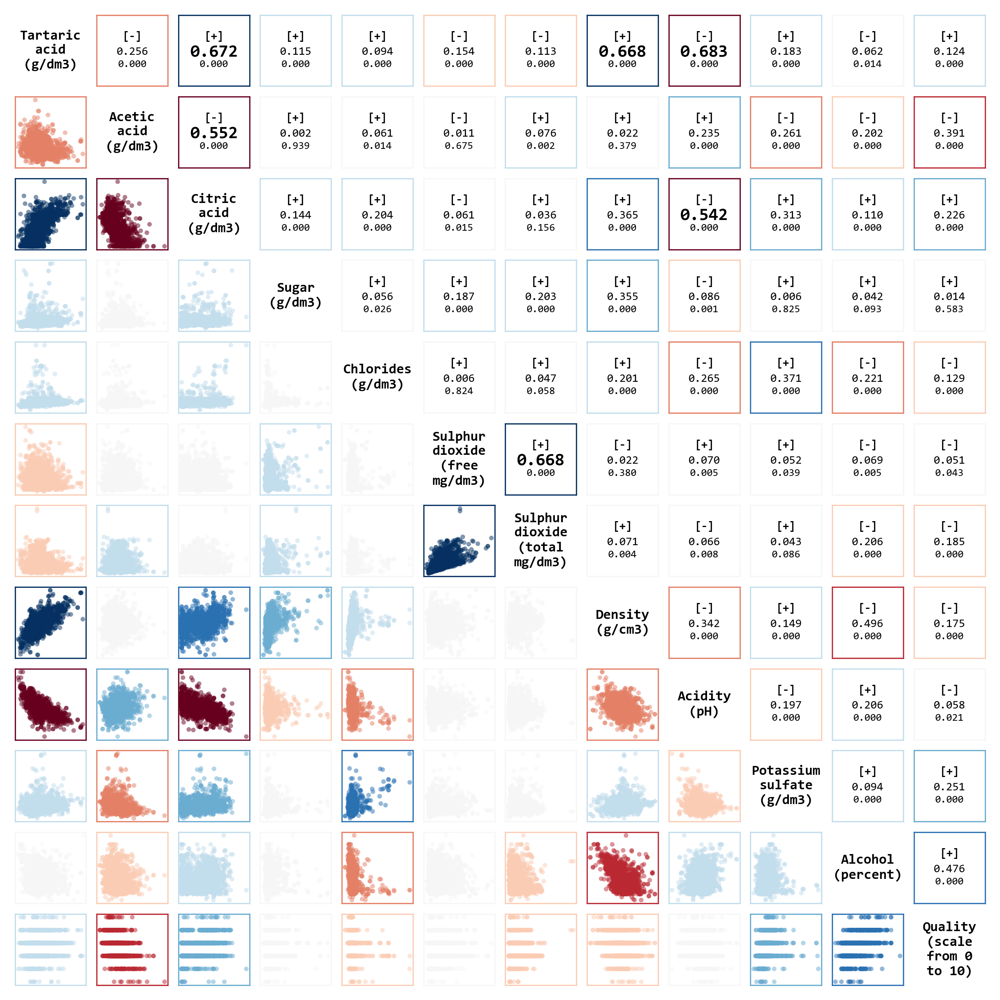
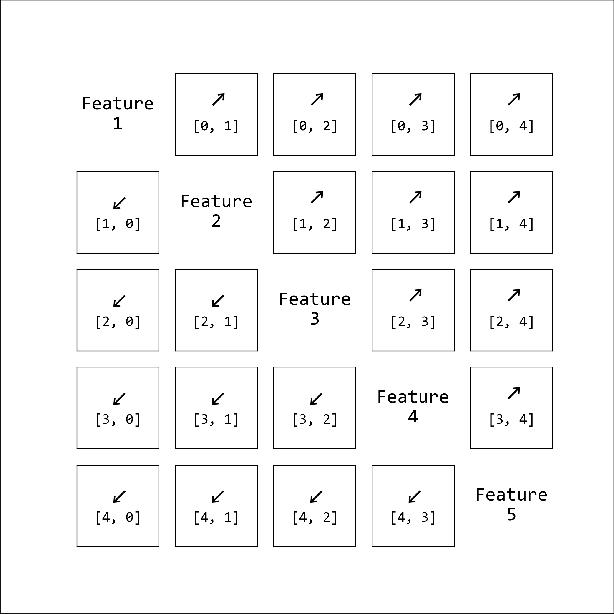
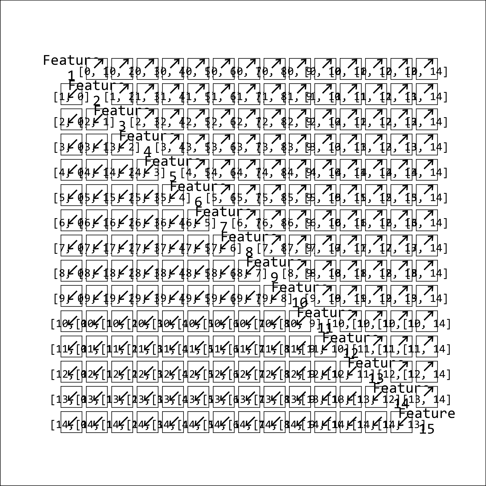
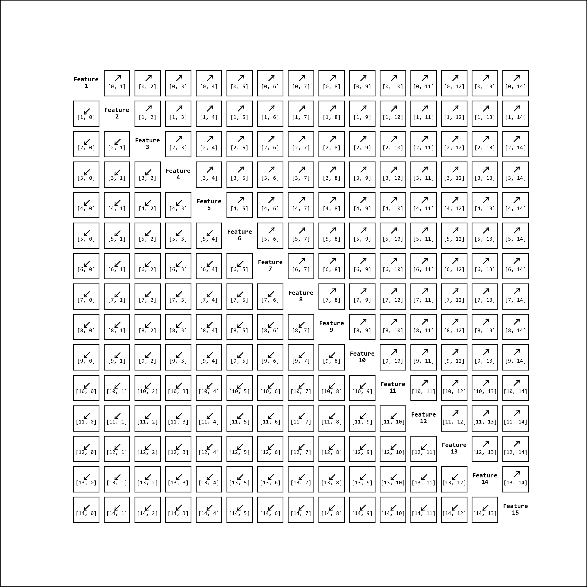

# Correlation Matrix in Python



In this step-by-step tutorial, learn how to create a correlation matrix for exploratory data analysis in Python from scratch.

### A Matrix of Subplots

```python
num_var = 5
fig = plt.figure(figsize=(9, 9))
for i in range(num_var ** 2):
    ax = fig.add_subplot(num_var, num_var, i + 1)
    ax.text(0.5, 0.5, str(i + 1), fontsize=20, ha="center", va="center")
plt.show()
```






