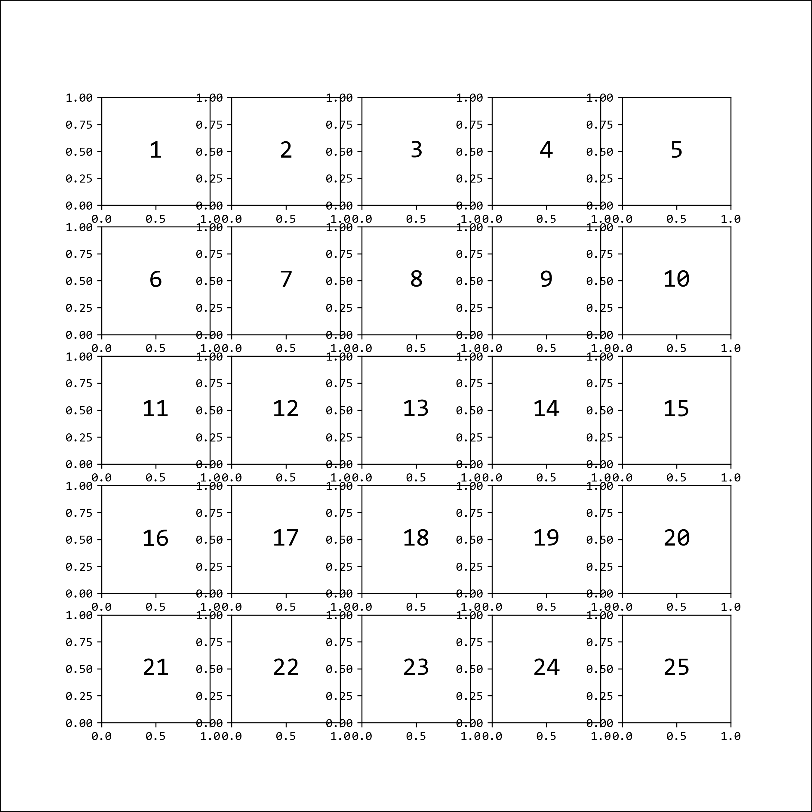

# How to build a Correlation Matrix in Python from scratch

Correlation is arguably the most important statistical metric in life sciences [Dolph book citation]. The Pearson coefficient `rho` ranges from `-1` to `+1`, where `-1` means perfect negative correlation, `+1` perfect positive correlation, and `0` means no linear correlation whatosever.

In this step-by-step tutorial, learn how to create a correlation matrix for exploratory data analysis in Python from scratch.

### Building the matrix structure

```python
num_var = 5
fig = plt.figure(figsize=(9, 9))
for i in range(num_var ** 2):
    ax = fig.add_subplot(num_var, num_var, i + 1)
    ax.text(0.5, 0.5, str(i + 1), fontsize=20, ha="center", va="center")
plt.show()
```




